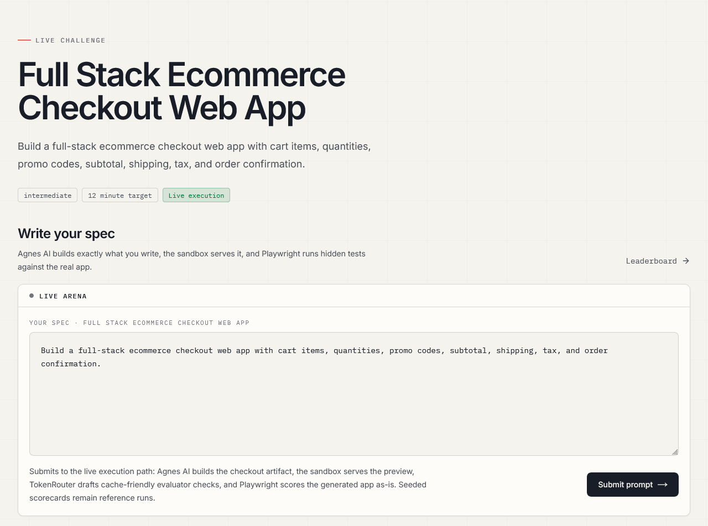
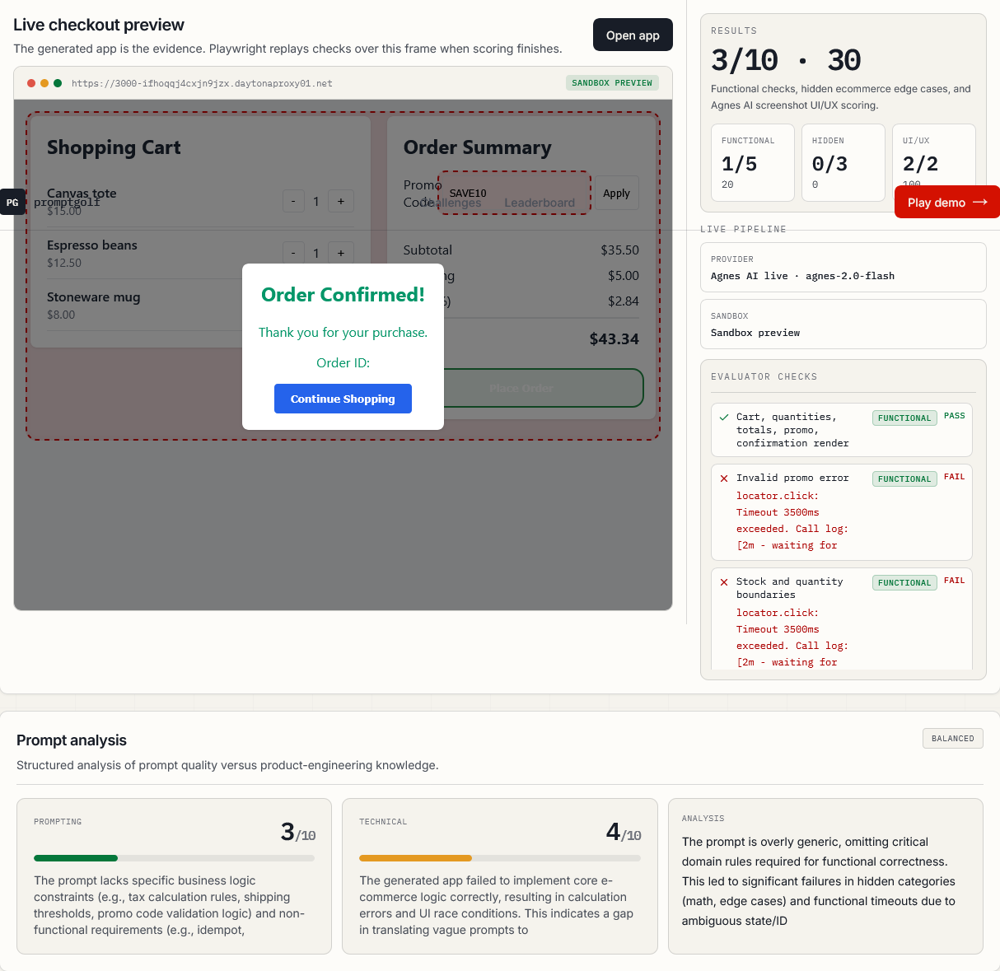
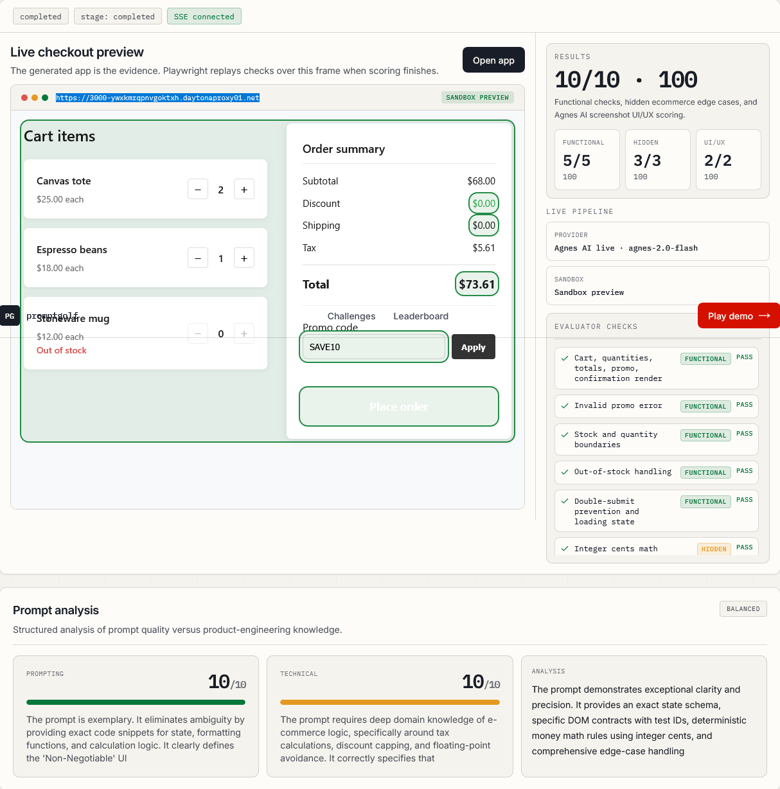

<div align="center">
  <h1>PromptGolf</h1>
  <p>
    LeetCode for agentic prompting: fewer prompts, more passing tests.
  </p>
  <p>
    Built with Next.js, React, TypeScript, Tailwind CSS, shadcn/ui, AI SDK v6, OpenAI, Daytona, Doubleword, and Playwright.
  </p>
</div>

---

<details>
<summary>Table of Contents</summary>

- [About](#about)
- [Demo](#demo)
- [Screenshots](#screenshots)
- [Getting Started](#getting-started)
  - [Prerequisites](#prerequisites)
  - [Installation](#installation)
  - [Execution](#execution)
- [Usage](#usage)
- [Provider Policy](#provider-policy)
- [Key Routes](#key-routes)
- [Roadmap](#roadmap)
- [Changelog](#changelog)
</details>

## About

PromptGolf tests prompting and domain skill by executing specs against real software tasks. An agent creates a framework-native multi-file workspace, then a sandbox builds and runs it. Evaluation records positive capability evidence through three pillars: behavior testing, spec completeness, and artifact adapter testing. It grades outcomes, never resemblance to a preferred implementation.

The current demo shows how a vague prompt can pass visible requirements while failing hidden ecommerce checks, and how a stronger domain-aware spec survives those checks.

The main challenge is a full-stack ecommerce checkout web app with cart items, quantities, promo codes, subtotal, shipping, tax, and order confirmation.

## Demo

1. Open the landing page.
2. Start the Full Stack Ecommerce Checkout Web App challenge.
3. Read the public brief and hidden-test teaser.
4. Submit a prompt from the challenge page; the app starts a live run and redirects to `/live-runs/[id]`.
5. Inspect the generated checkout preview, hidden-test replay, streaming log, Daytona posture, OpenAI builder state, and Doubleword post-score diagnosis.
6. Compare the seeded naive, structured, and expert reference runs on the leaderboard.

## Screenshots

<div align="center">
  
</div>

<div align="center">
  
  
</div>

## Getting Started

### Prerequisites

- Node.js 20+
- npm
- `OPENAI_API_KEY` for the builder and visual judge
- `DAYTONA_API_KEY` for sandbox execution
- `DOUBLEWORD_API_KEY` for post-score prompt diagnosis
- Optional `DOUBLEWORD_MODEL` override; defaults to `Qwen/Qwen3-VL-30B-A3B-Instruct-FP8`

### Installation

```bash
npm install
```

### Execution

Start the development server:

```bash
npm run dev
```

Run routine verification:

```bash
npm run lint
npm run build
```

Start the verified production server:

```bash
npm run build
npm run start
```

Then open <http://127.0.0.1:3000>.

## Usage

The submission path is intentionally real and provider-aware:

1. The challenge form validates the prompt and starts a live run.
2. OpenAI `gpt-5.4-mini` drives a bounded Daytona coding-agent loop: write, build, inspect, fix, start, and verify.
3. Daytona hosts all file writes, approved commands, production build/start, health checks, and preview serving; unavailable providers fail honestly.
4. The workspace adapter maps executable declarations, while Playwright observes semantic controls and behavior in the running artifact.
5. Stored validated EvalSpecs collect positive behavior and requirement evidence; prohibited negative, mutation, fingerprint, and preferred-method strategies are rejected by policy.
6. Doubleword produces structured prompt-versus-domain diagnosis only after the deterministic score is locked; diagnosis never changes the score.
7. Seeded naive, structured, and expert scorecards remain available as stable reference runs.

## Provider Policy

- OpenAI through `@ai-sdk/openai` powers the live builder and screenshot visual judge.
- Builder: `gpt-5.4-mini`, reasoning `medium`, verbosity `low`.
- Visual judge: `gpt-5.4-mini`, reasoning `low`.
- Doubleword through `@doubleword/vercel-ai` powers async post-score prompt diagnosis using `DOUBLEWORD_MODEL` or `Qwen/Qwen3-VL-30B-A3B-Instruct-FP8` by default.
- Offline EvalSpec authoring/review may use `gpt-5.5`, but contestant runs use stored validated EvalSpecs.
- Daytona remains the isolated workspace file/build/start/health/preview sandbox.
- Behavior grading is deterministic Playwright only, with no model-generated behavior score.
- Providers have fixed roles with no runtime switching or local artifact fallback. Missing Doubleword credentials degrade diagnosis without altering the locked score. CI tests use explicit stub boundaries so CI never needs or exposes real secrets.

## Key Routes

- `/` - landing page
- `/challenges` - challenge catalog
- `/challenges/mini-checkout-promo-engine` - primary demo challenge
- `/live-runs/[id]` - live generated app run and Playwright replay
- `/runs/expert-checkout` - expert reference run scorecard
- `/leaderboard` - ranked seeded runs
- `/api/challenges`, `/api/runs`, `/api/runs/[id]`, `/api/score`, `/api/generate-tests` - local product APIs; `/api/generate-tests` reports stored EvalSpecs rather than regenerating tests during contestant runs

## Roadmap

- Expand challenge catalog beyond ecommerce checkout.
- Add stronger generated-app evidence, screenshots, and replay artifacts.
- Improve live sandbox execution and provider observability.
- Add richer prompt feedback and hidden-test explanations.

## Changelog

See [CHANGELOG](CHANGELOG.md) for details.

## License <!-- omit in toc -->

Distributed under the MIT License.

## Credits <!-- omit in toc -->

- PromptGolf benchmark architecture and demo materials.

## Acknowledgements <!-- omit in toc -->

Inspired by Best-README-Template and Markdown All in One table-of-contents conventions.
